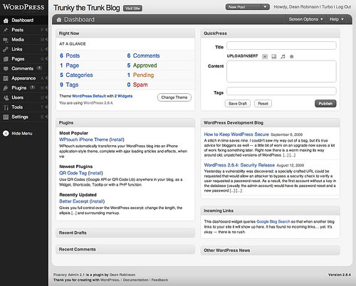
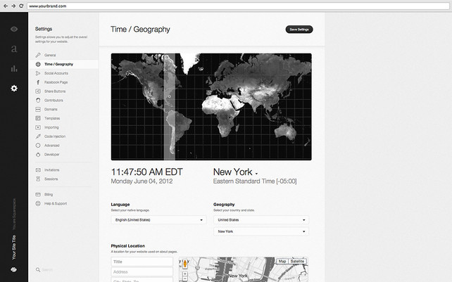

# Website builders are mainstream, and now there is a free software alternative

The word "website builder" may have multiple meanings but it has evolved today toward something different from the traditional CMS.

[Wikipedia's article about website builders](https://en.wikipedia.org/wiki/Website_builder) states that

> Website builders are tools that typically allow the construction of websites without manual code editing. They fall into two categories:
> * online proprietary tools provided by web hosting companies. These are typically intended for users to build their private site. Some companies allow the site owner to install alternative tools (commercial or open source) - the more complex of these may also be described as Content Management Systems;
> * offline software which runs on a computer, creating pages and which can then publish these pages on any host. (These are often considered to be "website design software" rather than "website builders".)

So it clearly does not include [Wordpress](https://wordpress.org/), [Joomla](https://www.joomla.org/) and the members of the huge CM family, which are usually free software and requires quite a bit of coding in order to do design but are great tools to edit lots of content (hence the name, Content Management Software).

It does include the great but declining familly of installed - sometime called heavy, desktop applications like [BlueGriffon](http://bluegriffon.org/), [Adobe Dreamweaver](http://www.adobe.com/products/dreamweaver.html). **But today the website builder world is clearly dominated by web proprietary applications like [Wix](http://www.wix.com/), [Squarespace](https://www.squarespace.com/) and co.** These are "SaaS" and "Freemium" services, which offer a great way to design websites with the mouse and little technical knowledge. They also lock the user in a solution and force them to use their paid __and expensive__ hosting. In some cases, the company monetize the visitors of the websites created with their tool, either sacrificing their privacy or exposing them to ads.

So now let's be serious, this kind of tool, which puts the internet users in a position where they are the product, need a free and open source alternative:
* Facebook has [Diaspora](https://joindiaspora.com/)
* Gmail has [Roundcube](https://roundcube.net/)
* Dropbox and Google Drive have [OwnCloud](https://owncloud.org/)
* and a French non profit organization is trying to "De-google-ify Internet", [meet Framasoft](https://degooglisons-internet.org/?l=en)

So now there is this other [French non profit organization Silex Labs](http://www.silexlabs.org), **they have developed collaboratively a tool to teach people web design, and it turns out that it is a very good free software alternative to proprietary website builders. [I present to you Silex, the free and open source website builder](http://www.silex.me/)**

Silex community makes [free and paid templates](), and [nice websites](). **They also have an [ongoing crowd funding campaign]() in order to make more of these templates, to produce documentation and also to add a "responsive mode" so that you can customize the mobile version of your website.** This is a great way to co-develop a software and make it fit your needs.

Note that Silex does not let you publish your website on its own, you will need a third party to host your website. And the crowd funding campaign is also a way to build an ecosystem of third party tools and services. This is why [Indie Hosters](https://indiehosters.net/page/home) offers free hosting or discount on their services to people who will participate to the crowd funding.

Come on and jump in!
